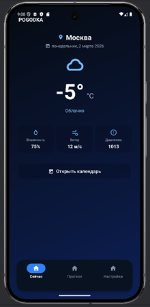
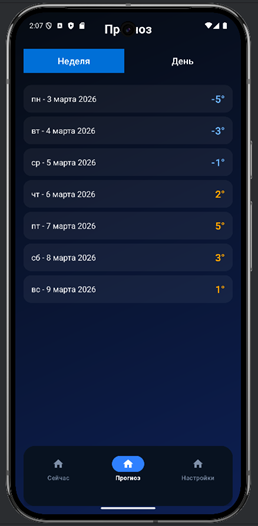
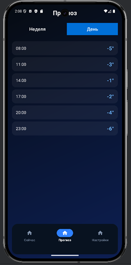
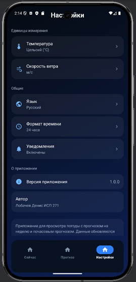

# 🌤️ POGODKA — Минималистичное погодное приложение

**POGODKA** — это простое, стильное и удобное приложение для просмотра погоды. Ничего лишнего: только актуальная информация о погоде сейчас, детальный прогноз и гибкие настройки. Разработано с любовью к минимализму и чистоте интерфейса.

---

## ✨ Возможности

- **🌡️ Текущая погода** — температура, влажность, скорость ветра и давление на одном экране
- **📅 Прогноз** — почасовой и на неделю с удобным переключением
- **🔍 Детальная информация** — иконки погоды, время, температура для каждого часа
- **⚙️ Настройки** — выбор единиц измерения (температура, ветер), языка, формата времени
- **🌙 Стильный дизайн** — градиенты, современные иконки, темная тема
- **📱 Адаптивность** — отлично выглядит на любых экранах

---

## 📸 Скриншоты

  
| Главный экран | Прогноз (неделя) | Прогноз (день) | Настройки |
|:-------------:|:----------------:|:--------------:|:---------:|
|  |  |  |  |

---

## 🛠 Технологический стек

- **Язык:** Kotlin
- **Платформа:** Android SDK (min API 21+)
- **Архитектура:** Activities + XML Layouts
- **UI:** Material Design, кастомные градиенты, собственные иконки
- **Навигация:** Bottom Navigation View
- **Локализация:** Поддержка русского и английского языков

---

## 👨‍💻 Автор

**Лобачев Денис**  
Студент ГБПОУ КАИТ №20, группа ИСП271  
GitHub: [DoKyyy67](https://github.com/DoKyyy67)

---

## 📄 Лицензия

Проект разработан в образовательных целях в рамках учебной практики.

---
## 💕 67 💕

